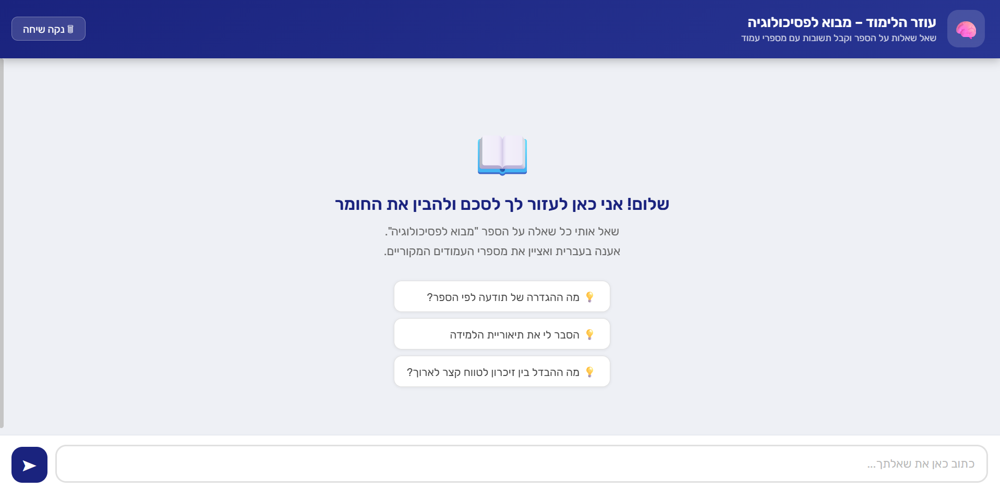

# 🧠 Psychology Textbook Chatbot

A Hebrew-language AI chatbot that answers questions about a university textbook PDF.
Ask any question in Hebrew and get a detailed answer with the exact **page numbers** from the book.

Built as a study tool for the course **מבוא לפסיכולוגיה** (Introduction to Psychology).

---

## ✨ Features

- 💬 **Hebrew interface** — fully RTL, ask and receive answers in Hebrew
- 📄 **Page citations** — every answer includes the source page numbers
- ⚡ **Streaming responses** — text appears word-by-word like ChatGPT
- 📝 **Markdown rendering** — bold, italic, lists, and headers rendered properly
- 🔍 **Semantic search (RAG)** — finds the most relevant pages per question using AI embeddings, not keyword matching
- 🚀 **Fast** — only sends ~4 relevant pages to Claude instead of the entire PDF

---

## 🛠 Tech Stack

| Layer | Technology |
|---|---|
| Frontend | HTML + CSS + Vanilla JS + [marked.js](https://marked.js.org/) |
| Backend | Python + [Flask](https://flask.palletsprojects.com/) |
| AI Model | [Claude Opus 4.6](https://anthropic.com) via Anthropic API |
| Embeddings | [sentence-transformers](https://www.sbert.net/) (`paraphrase-multilingual-MiniLM-L12-v2`) |
| PDF parsing | [PyMuPDF](https://pymupdf.readthedocs.io/) |
| Vector search | NumPy (cosine similarity) |

---

## 🚀 Setup & Usage

### 1. Clone the repository

```bash
git clone https://github.com/YOUR_USERNAME/YOUR_REPO_NAME.git
cd YOUR_REPO_NAME
```

### 2. Install dependencies

```bash
pip install flask anthropic python-dotenv pymupdf sentence-transformers numpy
```

### 3. Add your PDF

Place your textbook PDF in the project root and name it `info.pdf`.

### 4. Set your API key

Create a `.env` file in the project root:

```
ANTHROPIC_API_KEY=your_api_key_here
```

Get a free API key at [console.anthropic.com](https://console.anthropic.com).

### 5. Process the PDF *(run once)*

This extracts text from every page and creates semantic embeddings for fast search.
Takes a few minutes depending on the size of your PDF — only needs to run once.

```bash
python preprocess.py
```

This creates two files locally:
- `pages_data.json` — extracted text per page
- `embeddings.npy` — semantic vectors for similarity search

### 6. Start the chatbot

```bash
python app.py
```

Open your browser at **http://localhost:5000**

---

## 📁 Project Structure

```
├── app.py              # Flask backend — RAG pipeline + streaming API
├── preprocess.py       # One-time PDF processing script
├── requirements.txt    # Python dependencies
├── static/
│   └── index.html      # Frontend — Hebrew RTL chat UI
├── .env                # Your API key (not committed)
├── .gitignore
└── README.md
```

Files generated locally (not in the repo):
```
├── info.pdf            # Your textbook PDF
├── pages_data.json     # Extracted page text
└── embeddings.npy      # Page embeddings
```

---

## ⚙️ How It Works

```
User question
     │
     ▼
Embed question  ──►  Find top-4 similar pages  ──►  Build context (~3KB)
                      (cosine similarity)
                                                          │
                                                          ▼
                                                 Send to Claude API
                                                 (streaming response)
                                                          │
                                                          ▼
                                              Answer streams to browser
                                              + page numbers extracted
```

Instead of uploading the entire PDF on every question, the app:
1. Pre-processes the PDF once into per-page text + embeddings
2. On each question, embeds the query and finds the 4 most semantically relevant pages
3. Sends only those pages to Claude — making responses **fast and cheap**

---

## 📸 Demo

> Ask a question in Hebrew → get a streamed, formatted answer with source pages



---

## 📝 Notes

- The chatbot answers **only from the provided PDF** — it won't make things up
- Works best with text-based PDFs (not scanned images)
- The embedding model (`paraphrase-multilingual-MiniLM-L12-v2`) is downloaded automatically on first run (~90 MB, cached locally)
- You can swap `info.pdf` for any other Hebrew textbook and re-run `preprocess.py`
